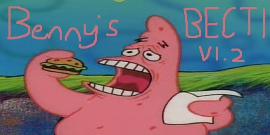

<h1 align="center">Benny's BECTI</h1>

  

  An Arma 3 mission originally created by Benny, modified by Zerty, and uniquely reconfigured and updated by myself.

# Monetization
This mission and all within the repository CANNOT be used for monetary purposes outlined by BiS at http://www.bistudio.com/monetization & http://www.bistudio.com/monetization/faq

# License

Reconfigured BECTI by Benny is licensed under a Creative Commons Attribution-NonCommercial-ShareAlike 4.0 International License.

Based on a work at http://forums.bistudio.com/showthread.php?166433-SP-MP-BeCTI & https://github.com/zerty/Benny-Edition-CTI-0.97-Zerty-Modification.

This project is not affiliated or authorized by Bohemia Interactive a.s. Bohemia Interactive, ARMA, DAYZ and all associated logos and designs are trademarks or registered trademarks of Bohemia Interactive a.s.

# Credits

• Benny for the mission

• Zerty for his modified mission

• Bl1p, Fluit for random AI skill

• =ATM=Pokertour for ATM airdrop

• Prodavec for Map Markers titling

• Farooq for his original idea of a revive script

• Sari for updating the sanitize scripts

• John681611 for his original idea of offroad aug.

• Henroth for his Aircraft loadout customisation framework.
